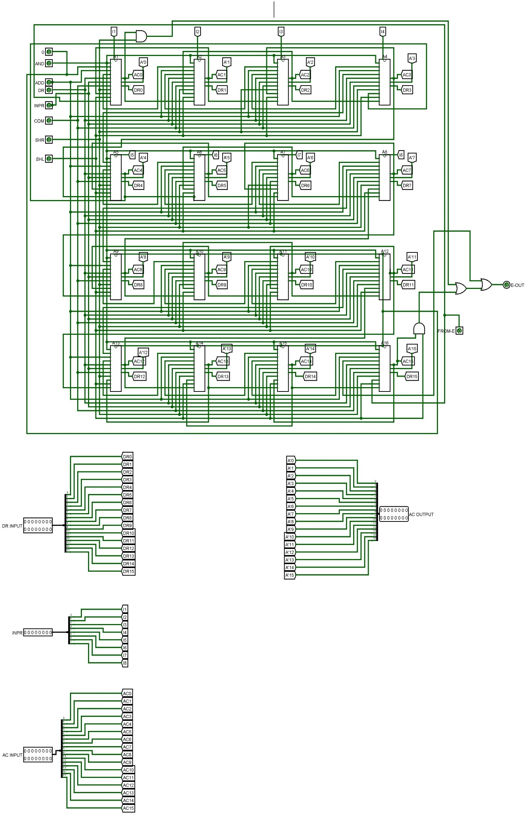
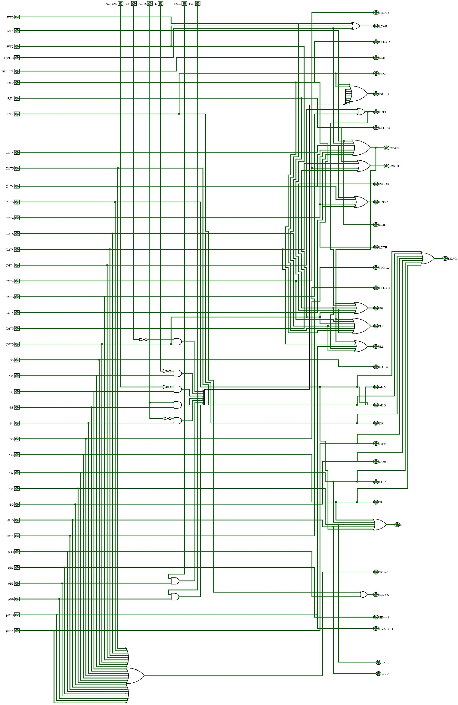
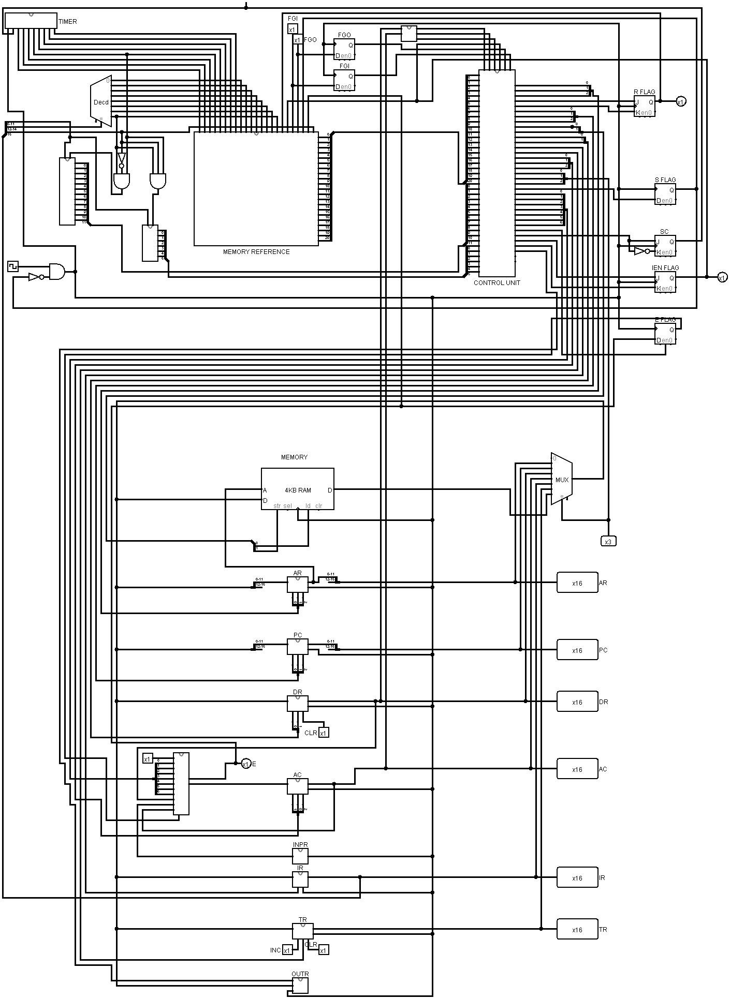

# Basic Computer Simulation Documentation

## Introduction

This repository contains documentation and simulation files for the Basic Computer, a simplified processor model designed for understanding computer organization and architecture principles.

## Hardware Components

### Memory Unit

- 4096 words of 16 bits each.

### Registers

- Address Register (AR)
- Program Counter (PC)
- Data Register (DR)
- Accumulator (AC)
- Instruction Register (IR)
- Temporary Register (TR)
- Input Register (INPR)
- Output Register (OUTR)

### Flip-flops

- Seven flip-flops for control purposes.

### Decoders

- 3 x 8 decoder for opcode decoding
- 4 x 16 timing decoder for Sequence Counter (SC)

### Common Bus System

- 16-bit common bus for data transfer.

### Control Logic Gates

- Combinational circuits for controlling operations.

### Arithmetic and Logic Unit (ALU)

- Performs operations like AND, ADD, Complement, Shift LEFT, Shift RIGHT, etc.

### Clock

- Common clock for synchronization.

### Memory / RAM

- 4096 X 16 RAM chip for storing instructions and data.

## Computer Registers

- Address Register (AR): 12 bits
- Program Counter (PC): 12 bits
- Data Register (DR): 16 bits
- Accumulator (AC): 16 bits
- Instruction Register (IR): 16 bits
- Temporary Register (TR): 16 bits
- Input Register (INPR): 8 bits
- Output Register (OUTR): 8 bits

## Common Bus System

- Facilitates efficient data transfer using selection lines S0, S1, and S2.

## Arithmetic and Logic Unit (ALU)

- Performs operations bit by bit (AND, ADD, Complement, Shift LEFT, Shift RIGHT, etc.).

## Common Clock

- Synchronizes all calculations and operations.

## Instruction Code

- Comprises fields like Mode, Opcode, and Address.

## Modes in Instruction

- Direct Addressing
- Indirect Addressing

## Types of Instructions

### Memory-Reference Instructions

- Operations like AND, ADD, LDA, STA, BUN, BSA, ISZ.

### Register-Reference Instructions

- CLA, CLE, CMA, CME, CIR, CIL, INC, SPA, SNA, SZA, SZE, HLT.

### Input/Output Reference Instructions

- INP, OUT, SKI, SKO, ION, IOF.

## Time and Control Unit

- Time Unit for micro-operations at each clock pulse.
- Control Unit manages instruction execution with flags (E, I, S, R, IEN, FGI, FGO).

## Instruction Cycle

- Fetching, decoding, reading effective addresses, and executing instructions.

## Interrupt Cycle

- Initiated when R interrupt flip-flop is set. Involves saving return address and branching.

## Using Logisim

- Simulate and visualize Basic Computer functionality using Logisim.

### Instructions for Simulation

1. Open Logisim.
2. Load the provided circuit file (Main.circ).
3. Simulate the circuit to observe Basic Computer behavior.

## Contributors

- Shubham Dwivedi
- Shashvat Tiwari
- Vaibhav Mishra

## Acknowledgments

- Thanks to Dr. Alok Kumar (HOD, IT Department , UIET Kanpur) for helping throughout working on this project.  

## Basic Computer Views

### Arithematic and Logic Unit

### Control Unit

### Basic Computer

